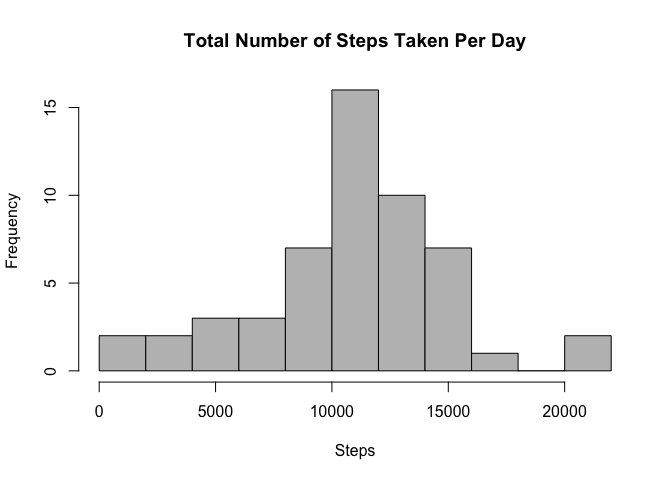
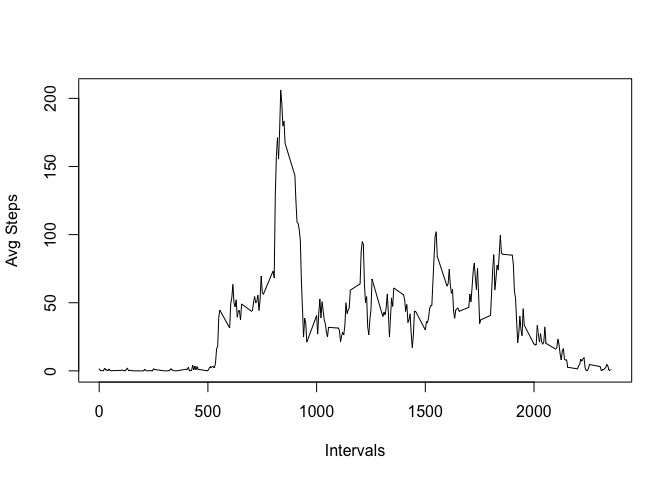
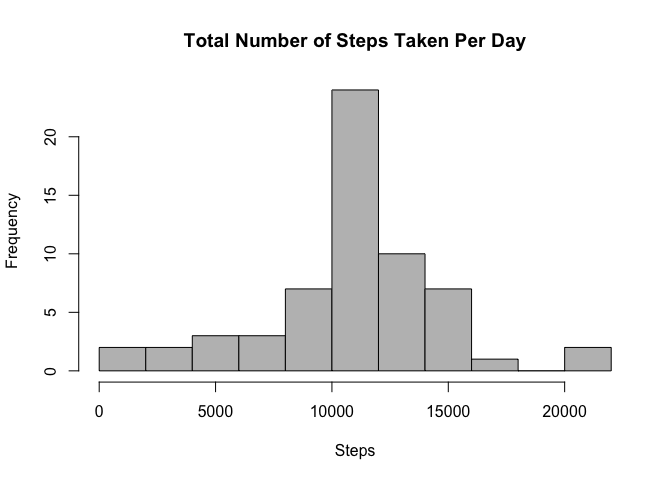
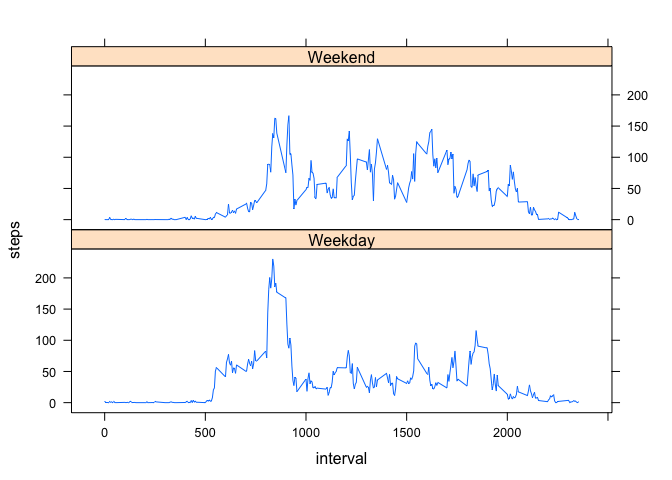

# Introduction

This assignment makes use of data from a personal activity monitoring device. This device collects data at 5 minute intervals through out the day. The data consists of two months of data from an anonymous individual collected during the months of October and November, 2012 and include the number of steps taken in 5 minute intervals each day.

**The variables included in this dataset are:**

- **steps:** Number of steps taking in a 5-minute interval (missing values are coded as 𝙽𝙰)
- **date:** The date on which the measurement was taken in YYYY-MM-DD format
- **interval:** Identifier for the 5-minute interval in which measurement was taken

The dataset is stored in a comma-separated-value (CSV) file and there are a total of 17,568 observations in this dataset.

# Assignment

## Loading and preprocessing the data


```r
library(tidyverse)
```

```
## ── Attaching packages ───────────────────────────────────── tidyverse 1.2.1 ──
```

```
## ✔ ggplot2 2.2.1     ✔ purrr   0.2.4
## ✔ tibble  1.3.4     ✔ dplyr   0.7.4
## ✔ tidyr   0.7.2     ✔ stringr 1.2.0
## ✔ readr   1.1.1     ✔ forcats 0.2.0
```

```
## ── Conflicts ──────────────────────────────────────── tidyverse_conflicts() ──
## ✖ dplyr::filter() masks stats::filter()
## ✖ dplyr::lag()    masks stats::lag()
```

```r
library(lattice)
library(lubridate)
```

```
## 
## Attaching package: 'lubridate'
```

```
## The following object is masked from 'package:base':
## 
##     date
```

```r
setwd("~/Projects/Coursera/RepData_PeerAssessment1")
data <- read.csv("./activity.csv", header = TRUE)

summary(data)
```

```
##      steps                date          interval     
##  Min.   :  0.00   2012-10-01:  288   Min.   :   0.0  
##  1st Qu.:  0.00   2012-10-02:  288   1st Qu.: 588.8  
##  Median :  0.00   2012-10-03:  288   Median :1177.5  
##  Mean   : 37.38   2012-10-04:  288   Mean   :1177.5  
##  3rd Qu.: 12.00   2012-10-05:  288   3rd Qu.:1766.2  
##  Max.   :806.00   2012-10-06:  288   Max.   :2355.0  
##  NA's   :2304     (Other)   :15840
```

```r
str(data)
```

```
## 'data.frame':	17568 obs. of  3 variables:
##  $ steps   : int  NA NA NA NA NA NA NA NA NA NA ...
##  $ date    : Factor w/ 61 levels "2012-10-01","2012-10-02",..: 1 1 1 1 1 1 1 1 1 1 ...
##  $ interval: int  0 5 10 15 20 25 30 35 40 45 ...
```

We see that Date is classified as a Factor. Let's convert it to a date. And there are many NA's so let's do away with them but preserve the orig data set.


```r
data$date <- ymd(data$date)
data2 <- subset(data, !is.na(data$steps))

summary(data2)
```

```
##      steps             date               interval     
##  Min.   :  0.00   Min.   :2012-10-02   Min.   :   0.0  
##  1st Qu.:  0.00   1st Qu.:2012-10-16   1st Qu.: 588.8  
##  Median :  0.00   Median :2012-10-29   Median :1177.5  
##  Mean   : 37.38   Mean   :2012-10-30   Mean   :1177.5  
##  3rd Qu.: 12.00   3rd Qu.:2012-11-16   3rd Qu.:1766.2  
##  Max.   :806.00   Max.   :2012-11-29   Max.   :2355.0
```

## What is mean total number of steps taken per day?

Calculate the total number of steps taken per day


```r
steps_per_day <- tapply(data2$steps, data2$date, sum)
sum(steps_per_day)
```

```
## [1] 570608
```

Make a histogram of the total number of steps taken each day.


```r
hist(steps_per_day, breaks = 15, col = "gray", xlab = "Steps", main = "Total Number of Steps Taken Per Day")
```

<!-- -->

Calculate the mean of the total number of steps taken per day.


```r
mean(steps_per_day)
```

```
## [1] 10766.19
```

Calculate the median of the total number of steps taken per day.


```r
median(steps_per_day)
```

```
## [1] 10765
```

## What is the average daily activity pattern?

Make a time series plot of the 5-minute interval and the avg number of steps taken, averaged across all days.


```r
interval_average <- tapply(data2$steps, data2$interval, mean)
interval_average2 <- data.frame(interval=as.integer(names(interval_average)), avg=interval_average)

with(interval_average2, plot(interval, avg, type="l", xlab = "Intervals", ylab = "Avg Steps"))
```

<!-- -->

Which interval avg contins the maximum number of steps?


```r
steps_max <- max(interval_average2$avg)
interval_average2[interval_average2$avg == steps_max, ]
```

```
##     interval      avg
## 835      835 206.1698
```

Interval 835 has the max steps of 206.16.

## Imputing missing values

Calculate the total number of missing values.


```r
sum(is.na(data$steps))
```

```
## [1] 2304
```

There are 2,304 rows with `NA`s

Use the mean to fill in missing data


```r
impute_data <- data
impute_data2 <- is.na(impute_data$steps)

interval_average2 <- tapply(data2$steps, data2$interval, mean, na.rm = TRUE)
impute_data$steps[impute_data2] <- interval_average2[as.character(impute_data$interval[impute_data2])]
```

Make a histrogram of the total number of steps taken each day.


```r
steps_per_day2 <- tapply(impute_data$steps, impute_data$date, sum)

hist(steps_per_day2, breaks = 15, col = "gray", xlab = "Steps", main = "Total Number of Steps Taken Per Day")
```

<!-- -->


```r
mean(steps_per_day2)
```

```
## [1] 10766.19
```

On average, there are 10,766 steps per day


```r
median(steps_per_day2)
```

```
## [1] 10766.19
```

The median steps per day is 10,766

## Are there differences in activity patterns between weekdays and weekends?

Create a new factor with 'Weekend' and 'Weekday' levels


```r
impute_data$day <- weekdays(as.Date(impute_data$date))

impute_data$day_type <- ifelse(impute_data$day == "Saturday" | impute_data$day == "Sunday", "Weekend","Weekday")
```

Make a panel plot containing a time series plot of the 5-minute interval and the avg number of steps taken, averaged across all weekday or weekend days.


```r
weekday_data <- aggregate(steps ~ day_type+interval, data=impute_data, FUN = mean)

xyplot(steps ~ interval | factor(day_type), layout = c(1, 2), type = "l", data = weekday_data)
```

<!-- -->

